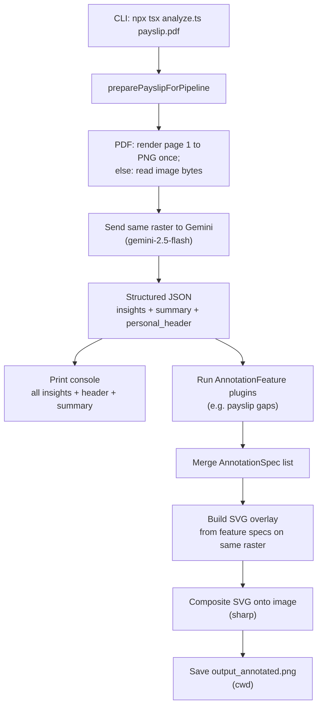

# Gemini Payslip Analyzer -- Project Documentation

## Goal

Build a CLI tool that takes a salary pay slip (image or PDF, written in Hebrew), sends it to Google Gemini for multimodal analysis, extracts financially significant fields with spatial bounding box coordinates, and prints a full console dump of raw extractions. **Visual annotation** is driven by pluggable **features** (for example [Payslip Gaps](feature/payslip-gaps.md)), not by drawing every extracted insight on the image.

For **low-level design** (modules, contracts, registry, how to add features), see [architecture.md](architecture.md). For **bounding box accuracy** (shared raster, crop refinement, anti-patterns), see [bounding_boxes.md](bounding_boxes.md).

The target use cases for an Israeli pay slip include:

- Identifying total pension contributions (employee + employer)
- Identifying total Keren Hishtalmut contributions
- Surfacing expense reimbursements
- Extracting net pay, gross pay, tax, social security, and health insurance
- Providing financial warnings and actionable tips

## Tech Stack

| Component | Technology | Purpose |
|---|---|---|
| Language | TypeScript (ES2022, Node16 modules) | Type-safe scripting |
| Runtime | Node.js v20+ | Execution environment |
| AI Model | Google Gemini `gemini-2.5-flash` | Multimodal document analysis, OCR, bounding box extraction |
| AI SDK | `@google/genai` | Unified Google Gen AI SDK for TypeScript |
| Image Processing | `sharp` | SVG compositing for bounding box annotation |
| PDF Rendering | `pdfjs-dist` + `canvas` (node-canvas) | Rasterize PDF page 1 for both Gemini input and annotation (aligned boxes) |
| TS Execution | `tsx` | Run `.ts` files directly without a build step |
| Secret Management | 1Password CLI (`op`) | Inject `GEMINI_API_KEY` at runtime |

## Project Structure

```
payslip-analyzer/
  ├── analyze.ts            # Thin entry (imports src/analyze.ts for run.sh / habits)
  ├── src/
  │   ├── analyze.ts        # CLI: prepare → Gemini → console → features → annotate
  │   ├── payslip-input.ts  # Shared raster for PDF/image + Gemini inline payload
  │   ├── pdf-render.ts     # pdf.js page 1 → PNG
  │   ├── box2d.ts          # Normalized box → pixel rect (clamp + corner order)
  │   ├── schema.ts         # Prompts + responseJsonSchema
  │   ├── gemini.ts         # API call + normalization
  │   ├── annotate.ts       # SVG + Sharp compositing from AnnotationSpec[]
  │   ├── console.ts        # Console output
  │   ├── types.ts          # Shared types
  │   └── features/         # Pluggable annotation features
  │       ├── registry.ts
  │       └── payslip-gaps/ # Gap detectors (e.g. nekudot zikui)
  ├── package.json
  ├── tsconfig.json
  ├── .env
  ├── run.sh
  ├── docs/
  │   ├── project.md
  │   ├── architecture.md   # Module design, feature registry, extension guide
  │   ├── bounding_boxes.md # Accurate overlays: same raster, crop 2nd pass, pitfalls
  │   └── feature/
  │       ├── payslip-gaps.md
  │       └── pension-contribution-ratios.md
  └── README.md
```

## How It Works

### Flow



### Step-by-Step

1. **CLI argument parsing** -- The script takes a single argument: a file path to a pay slip (PNG, JPEG, WebP, or PDF).

2. **Prepare input** -- For images, the file bytes are read once. For PDFs, page 1 is rendered to a PNG with pdf.js (same buffer for analysis and overlays). The buffer is base64-encoded for Gemini with the appropriate MIME type (`image/png` for rendered PDFs).

3. **Gemini API call** -- That inline payload is sent to `gemini-2.5-flash` alongside a structured prompt. Key configuration:
   - `temperature: 0` for deterministic extraction
   - `thinkingConfig: { thinkingBudget: 0 }` to disable the model's internal reasoning (reduces latency for extraction tasks)
   - `responseMimeType: "application/json"` with a `responseJsonSchema` to enforce structured output
   - A `systemInstruction` that sets the model's role as an Israeli payslip analyst fluent in Hebrew

4. **Response parsing** -- The JSON response is normalised into `AnalysisResult`: `insights[]`, `summary`, and `personal_header` (header fields such as נקודות זיכוי and employee gender for programmatic features). Each insight contains a `category`, `label`, `value`, `box_2d`, and `explanation`.

5. **Console summary** -- All extracted insights are printed with category, label, value, and explanation. `personal_header` is printed under a dedicated section. The summary shows aggregated totals, warnings, and tips. Feature plugins may append lines (for example payslip gap messages).

6. **Feature-driven image annotation** -- Registered `AnnotationFeature` modules consume the parsed result and return `AnnotationSpec` entries (normalised `box_2d`, stroke colour, label). Only those specs are drawn (SVG rectangles + badges, then Sharp composite). **Payslip gap** highlights use red. If there are no specs, the raster image is still written without overlays.

7. **PDF handling** -- The first page is rendered once with `pdfjs-dist` + `node-canvas` to a PNG buffer (scale 3× by default for sharper numbers). That **same** buffer is base64-encoded and sent to Gemini as `image/png`, then composited for annotations. This keeps normalized `box_2d` coordinates aligned with the pixels we draw on (Gemini’s internal PDF rasterization previously did not match our renderer, which caused misplaced boxes).

### Prompt Design

The prompt is split into two parts:

- **System instruction**: Establishes the model as an expert Israeli payslip analyst. Instructs it to extract every financially significant field into `insights`, fill `summary`, and populate `personal_header` (including נקודות זיכוי with a tight `box_2d` and optional parsed `points`, `employee_gender` when explicitly shown, and **`pension_compliance`** for pension-ratio checks — see [feature/pension-contribution-ratios.md](feature/pension-contribution-ratios.md)).

- **User prompt**: Accompanies the image/PDF. Lists financially significant Hebrew terms and requires header extraction for נקודות זיכוי.

### Structured Output Schema

The Gemini response is constrained via `responseJsonSchema` to return:

```
{
  insights: [ { category, label, value, box_2d, explanation } ],
  summary: {
    total_pension, total_keren_hishtalmut, total_expenses_reimbursed, net_pay,
    warnings, tips
  },
  personal_header: {
    tax_credit_points: { raw_text, points?, box_2d },
    employee_gender: "male" | "female" | "unknown",
    pension_compliance: {
      pensionable_salary: { raw_text, amount_ils?, box_2d },
      employer_tagmulim: { raw_text, amount_ils?, box_2d },
      employee_pension_deduction: { raw_text, amount_ils?, box_2d }
    }
  }
}
```

See [docs/feature/payslip-gaps.md](feature/payslip-gaps.md) for how `personal_header` feeds gap detection; pension fields are detailed in [feature/pension-contribution-ratios.md](feature/pension-contribution-ratios.md).

## Requirements

### System Requirements

- Node.js v20 or later
- npm

### API Requirements

- A Google Gemini API key (`GEMINI_API_KEY` environment variable)
- Access to the `gemini-2.5-flash` model

### Optional (for `run.sh` convenience)

- [1Password CLI (`op`)](https://developer.1password.com/docs/cli/) installed and signed in, to inject the API key from a vault

### Dependencies (installed via `npm install`)

| Package | Version | Role |
|---|---|---|
| `@google/genai` | ^1.48.0 | Gemini API SDK |
| `sharp` | ^0.33.0 | Image compositing |
| `pdfjs-dist` | ^4.9.155 | PDF page rendering |
| `canvas` | ^3.2.3 | Node.js canvas for PDF.js |
| `tsx` | ^4.0.0 (dev) | Run TypeScript directly |
| `typescript` | ^5.5.0 (dev) | Type checking |
| `@types/node` | ^22.0.0 (dev) | Node.js type definitions |

## How to Run

```bash
# Install dependencies
npm install

# Option 1: via run.sh (uses 1Password for API key)
./run.sh path/to/payslip.pdf

# Option 2: direct with environment variable
GEMINI_API_KEY=your-key npx tsx analyze.ts path/to/payslip.pdf

# Supported input formats: PNG, JPEG, WebP, PDF
```

Output:
- Console prints all extracted insights, `personal_header`, summary, and feature messages
- `output_annotated.png` is saved in the **current working directory** with bounding boxes only from registered features (payslip gaps in red)

## What We Tried and What Didn't Work

### Sharp for PDF-to-image rendering -- failed

The initial implementation relied on Sharp's ability to render PDFs via `sharp(pdfPath, { pages: 1 }).png().toBuffer()`. This works when the underlying `libvips` library is compiled with poppler or pdfium support. In the devcontainer environment used for this project, libvips did not include PDF support, so Sharp threw an error.

The symptom: the Gemini analysis completed successfully (the console printed all 23 extracted fields and the summary), but the annotation step silently fell into a catch block that printed a warning and returned without creating the output file:

```
Warning: Could not render PDF to image for annotation.
The analysis results are printed above but no annotated image was created.
Convert the PDF to PNG/JPEG and re-run to get visual annotations.
```

**Fix**: Replaced Sharp-based PDF rendering with `pdfjs-dist` (Mozilla's PDF.js) combined with `canvas` (node-canvas). This is a pure-JavaScript PDF renderer that doesn't depend on system libraries like poppler. It renders the first page of the PDF at 2x scale onto a node-canvas, then exports the result as a PNG buffer. This approach works reliably across environments.

### System-level PDF tools -- not available

Before settling on `pdfjs-dist`, we checked for `pdftoppm` (poppler-utils), `convert` (ImageMagick), and `gs` (Ghostscript). None were installed in the devcontainer. Rather than adding system-level dependencies (which would complicate portability), we chose the pure Node.js solution.

### Gemini model selection

We considered several models:
- **`gemini-3-flash-preview`**: The newest default per Google's SDK codegen instructions, but bounding box detection with this model is less battle-tested for document processing.
- **`gemini-2.5-pro`**: Higher accuracy for complex reasoning, but slower and more expensive. Overkill for structured extraction from a single document.
- **`gemini-2.5-flash`**: Proven bounding box support in `[ymin, xmin, ymax, xmax]` normalised 0-1000 format, strong document understanding, native PDF support, cost-effective. This was the clear winner for the MVP.

### Temperature and thinking budget

Setting `temperature: 0` is critical for this use case. You want deterministic, reproducible spatial extraction -- not creative variation. Similarly, disabling the model's internal "thinking" via `thinkingConfig: { thinkingBudget: 0 }` reduces latency without sacrificing extraction accuracy, since the task is direct extraction rather than multi-step reasoning.

## Learnings and Insights

### Gemini handles Hebrew OCR; PDFs are rasterized locally for alignment

No special OCR preprocessing or language configuration was needed. The `gemini-2.5-flash` model reads Hebrew text from pay slip images with high accuracy. For **PDF** inputs we rasterize page 1 locally and send **PNG** to Gemini so bounding boxes (0–1000) match the same pixels used for SVG overlays. Native PDF upload to Gemini is still possible in other tools, but a single shared raster avoids coordinate drift between analysis and annotation.

### Structured output with `responseJsonSchema` is powerful

By providing a JSON schema to the Gemini API, the response is guaranteed to conform to the expected structure. This eliminates the need for fragile regex parsing or manual JSON extraction from markdown-fenced code blocks. The schema acts as both a contract and documentation for the model's output.

### Bounding box normalisation (0-1000) is a practical standard

Gemini returns coordinates normalised to a 0-1000 scale regardless of the actual image dimensions. This makes the coordinate system resolution-independent: `pixelX = (normX / 1000) * imageWidth`. The same approach is used by the reference Python object detection project and appears to be a consistent convention across Gemini's vision capabilities.

### SVG compositing via Sharp works well for annotation

Sharp doesn't have native drawing APIs (no `drawRect` or `drawText`), but its SVG compositing via `sharp.composite([{ input: svgBuffer }])` is a clean workaround. You generate an SVG string with rectangles and text elements at the exact pixel positions, convert it to a buffer, and composite it onto the source image. The SVG gives full control over colors, fonts, opacity, and positioning.

### The analysis and annotation pipelines have different input requirements

**Coordinate alignment:** Annotation needs a raster. If analysis used a different PDF raster than annotation (e.g. Gemini’s internal render vs pdf.js), normalized boxes appeared shifted on the output image. **Mitigation:** one `preparePayslipForPipeline` step produces the raster used for both Gemini and Sharp (see [architecture.md](architecture.md)).

### The `@google/genai` SDK is the only current TypeScript SDK

The older libraries (`@google/generative-ai` for Gemini API, `@google-cloud/vertexai` for Vertex AI) have reached end-of-life. The unified `@google/genai` package is the single SDK going forward. It picks up `GEMINI_API_KEY` from the environment automatically when initialised with `new GoogleGenAI({})`.
