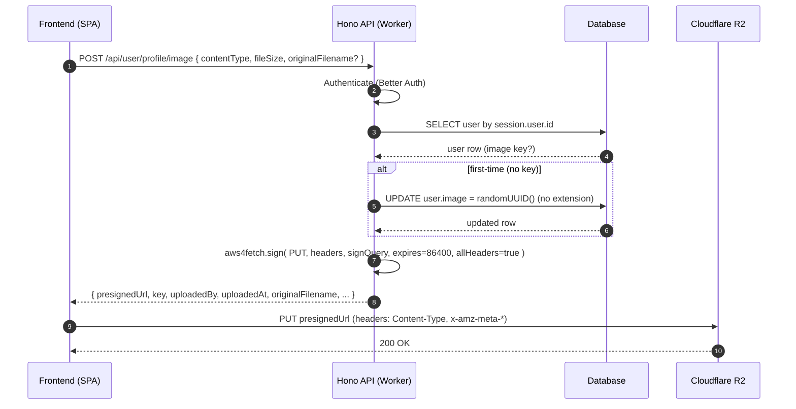
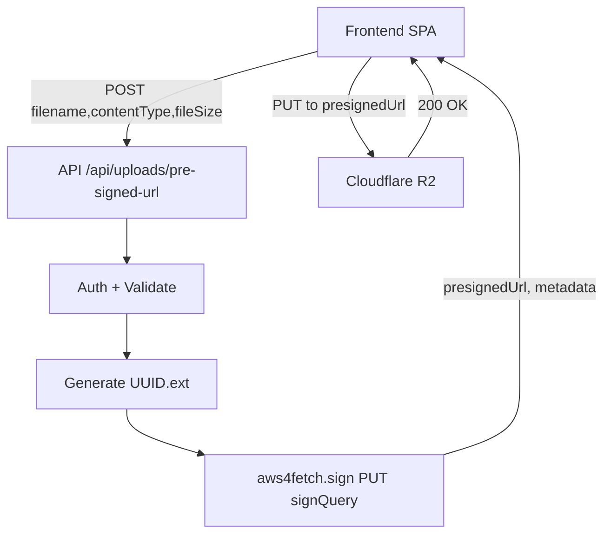
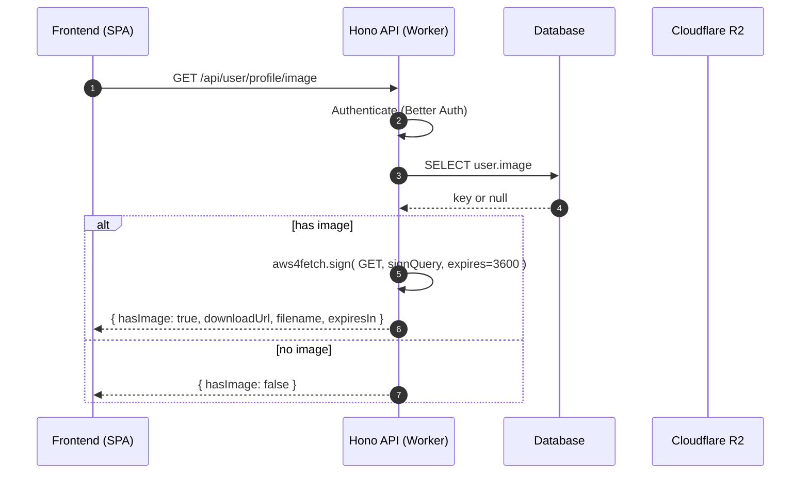

# Pre-Signed URL Upload Architecture (Cloudflare R2 + Hono Workers)

## Purpose
This document describes a reference architecture for secure, direct browser uploads and downloads to Cloudflare R2 using time-limited pre-signed URLs generated by a Hono application on Cloudflare Workers. It covers flows, contracts, security decisions, and pitfalls.

## Components
- Hono API (Cloudflare Workers)
  - Authentication: Better Auth
  - Database: Postgres via Drizzle ORM
  - Storage: Cloudflare R2 (S3-compatible)
- Frontend SPA (Nuxt)
  - Performs direct PUT uploads and GET downloads via pre-signed URLs

## Environment and Bindings
- Worker binds the bucket as `env.GALLERY` (bucket name: `gallery`).
- Secrets: `CLOUDFLARE_ACCOUNT_ID`, `R2_ACCESS_KEY_ID`, `R2_SECRET_ACCESS_KEY`.
- R2 signing uses `aws4fetch` (Workers-compatible `fetch` + `SubtleCrypto`).

## Data Model (Profile Images)
- `user.image` stores the object key (stable, no extension) in the `gallery` bucket.
- First assignment persists a random UUID (no extension). Subsequent uploads overwrite the same object to avoid object sprawl.

## CORS Policy (R2)
R2 requires explicit header names (wildcards are unreliable). Example rule:

```json
{
  "rules": [
    {
      "allowed": {
        "methods": ["PUT", "GET", "POST", "DELETE"],
        "origins": ["*"],
        "headers": [
          "content-type",
          "x-amz-meta-original-filename",
          "x-amz-meta-uploaded-at",
          "x-amz-meta-uploaded-by",
          "x-amz-meta-uploader-id",
          "x-amz-meta-uploader-type",
          "x-amz-meta-file-id",
          "x-amz-meta-link-id"
        ]
      },
      "exposeHeaders": ["ETag"],
      "maxAgeSeconds": 3000
    }
  ]
}
```

**CRITICAL**: Every `x-amz-meta-*` header you include in the signed URL MUST be listed in the CORS `headers` array. Failure to do so will result in CORS errors during the direct PUT upload.

## Request/Response Contracts (Summary)

### Critical Rule: Return ALL Signed Headers
When generating a presigned URL, the backend signs certain headers into the URL signature. The frontend MUST send these exact headers in the PUT request, or R2 will return 403. Therefore:

1. **Backend**: Return ALL signed headers in the response `headers` object
2. **Frontend**: Send ALL headers from the response (iterate over the object, don't cherry-pick)

```typescript
// Backend: Return all signed headers
return {
  uploadUrl: presignResult.url,
  headers: {
    'Content-Type': mimeType,
    'x-amz-meta-original-filename': filename,
    'x-amz-meta-uploaded-at': uploadedAt,
    'x-amz-meta-uploader-id': uploaderId,       // Don't forget these!
    'x-amz-meta-uploader-type': uploaderType,
    'x-amz-meta-file-id': fileId,
    'x-amz-meta-link-id': linkId,
  }
}

// Frontend: Send ALL headers
for (const [key, value] of Object.entries(headers)) {
  xhr.setRequestHeader(key, value)
}
```

### Endpoints
- Generic upload URL: `POST /api/uploads/pre-signed-url` (UUID per object)
- Profile image upload URL (stable key): `POST /api/user/profile/image`
  - Request: `{ contentType: string, fileSize: number, originalFilename?: string }`
  - Response: `{ presignedUrl, key, contentType, fileSize, expiresIn: 86400, uploadedBy, uploadedAt, originalFilename, headers: {...} }`
  - Frontend must upload with ALL headers from the `headers` object
  - Do not set `Content-Length` manually.
- Profile image download URL: `GET /api/user/profile/image` → returns pre-signed GET URL (default 3600s).

## Flow: Profile Image Upload (Stable Key, Overwrite)


## Flow: Generic Upload (UUID per Object)


## Flow: Profile Image Download


## Security Model and Decisions
- Authentication enforced for all signing endpoints.
- Authorization: profile image key is scoped to authenticated user; generic uploads still require session.
- Upload pre-signed URLs default to 24h (86400s); download URLs commonly 1h (3600s). Use shorter TTLs if needed.
- Overwrite policy for profile images ensures a single object per user.

## Implementation Notes
- Signing: `aws4fetch` options `aws: { signQuery: true, expires: 86400, allHeaders: true }` to include `Content-Type` in the signature.
- R2 object URL: `https://<account-id>.r2.cloudflarestorage.com/<bucket>/<key>`.
- Stable key is UUID without extension; determined/created on first call, then reused.
- Database update for profile (name-only) must not null `image` unless `image` field is explicitly provided.
- Backend must return the exact metadata used for signing; frontend must reuse it when uploading.
- Generate timestamps once on the backend and reuse in the response to avoid signature drift.

## Deferred File Record Creation Pattern

For file uploads that need database tracking, use "deferred record creation" to handle upload failures gracefully.

### Problem
If you create database records at presign time and the R2 upload fails (due to CORS, network issues, etc.), you end up with orphaned records. When the user retries, duplicate detection finds the orphaned record and incorrectly reports "file already exists".

### Solution
1. **Presign endpoint**: Validate request, check for duplicates by hash, generate presigned URL, but DO NOT create database record. Return all metadata needed for confirm.
2. **R2 upload**: Frontend uploads directly to R2.
3. **Confirm endpoint**: Create the database record only after successful R2 upload.

### Benefits
- Failed uploads don't leave orphaned database records
- Retries work correctly without false duplicate detection
- Confirm endpoint is idempotent (re-confirming same fileId returns existing record)
- Hash-based duplicate detection happens at both presign (early reject) and confirm (final check)

### Data Flow
```
Presign (no DB write)     →     R2 Upload     →     Confirm (DB write)
     ↓                              ↓                      ↓
  Returns:                    Direct PUT to          Creates file
  - uploadUrl                 presigned URL          record with
  - fileId                                           all metadata
  - metadata for confirm
```

### Confirm Endpoint Contract
The confirm endpoint receives all metadata from presign response and creates the record:
- `fileId`, `r2Key`, `uploaderId`, `uploaderType`, `hash`, `filename`, `mimeType`, `size`, `exifData` (optional)

## Known Pitfalls and Mitigations

### Header Signing Rules (Critical)
The presigned URL signature includes specific headers. **ALL signed headers must be sent by the frontend**, or R2 returns 403:

| Step | Requirement |
|------|-------------|
| Backend signs | Headers included in `metadata` option → become signed headers |
| Backend returns | Must return ALL signed headers in response `headers` object |
| Frontend sends | Must send ALL headers from response in PUT request |

**Rule**: `headers signed` = `headers returned` = `headers sent`

**Common Mistake**: Backend signs 7 headers but only returns 3 → frontend only sends 3 → signature mismatch → 403

### Other Pitfalls
- Wildcard CORS headers are unreliable on R2 → explicitly allow `content-type` and ALL required `x-amz-meta-*` headers.
- Missing `Content-Type` in signature → 403; ensure it's included in the signed headers and in the upload.
- Do not send `Content-Length` from the browser.
- AWS SDK v3 is not Workers-compatible (e.g., `DOMParser`), use `aws4fetch`.
- Inconsistent expiration across flows; standardize.
- Undefined metadata (e.g., `originalFilename`) leads to signature mismatch; always return and reuse exact values.
- Creating database records at presign time → orphaned records on upload failure; use deferred record creation pattern.
- Adding new `x-amz-meta-*` headers to signing → must also update R2 CORS policy or uploads will fail with CORS error.

## Operational Considerations
- Logging: record pre-signed generation events (do not log secrets).
- Rate limiting (future): throttle pre-signed URL issuance per user.
- Orphaned objects (future): generic uploads may need cleanup or commit semantics.
- Versioning (future): store multi-version keys instead of overwrite if historical versions are required.

## Testing Checklist
- CORS preflight for PUT passes with required headers.
- Upload PUT succeeds with exact headers from response.
- Download GET URL works and respects TTL.
- Repeated profile uploads overwrite the same key; `user.image` remains stable.
- Name-only profile updates leave `user.image` unchanged.
- Failed uploads can be retried without "duplicate file" errors.
- Confirm endpoint is idempotent for same fileId.
- Verify presign response `headers` object contains ALL signed headers.
- Verify frontend sends ALL headers from presign response (not just Content-Type).

## Debugging 403 Errors on PUT

If you get 403 Forbidden on the PUT to the presigned URL:

1. **Check signed headers**: Decode `X-Amz-SignedHeaders` from the presigned URL
2. **Check returned headers**: Log the `headers` object from the presign response
3. **Check sent headers**: Use browser devtools Network tab to see actual request headers
4. **Verify match**: All three sets must be identical

```bash
# Decode X-Amz-SignedHeaders from URL (semicolon-separated, URL-encoded)
# Example: content-type%3Bhost%3Bx-amz-meta-file-id → content-type;host;x-amz-meta-file-id
```
