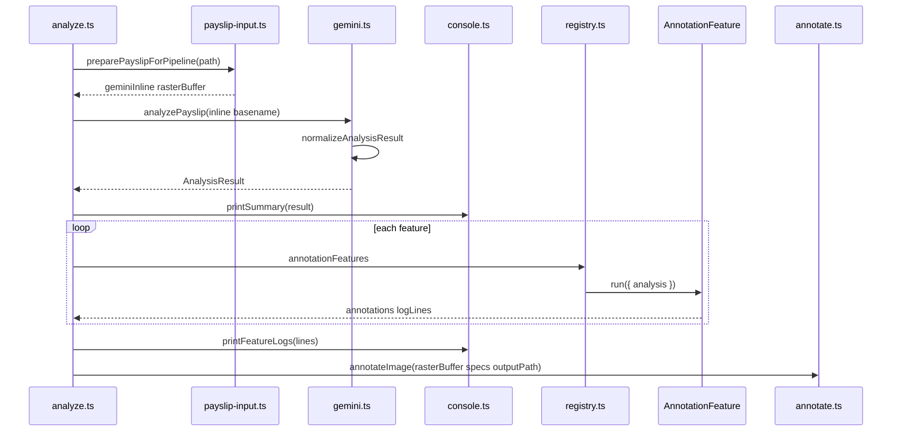
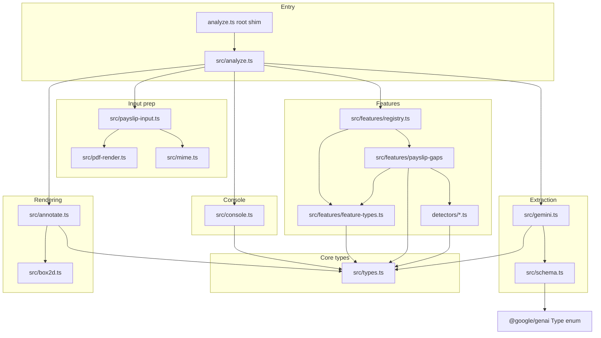

# Architecture — Payslip Analyzer

This document describes the **low-level design** of the CLI after the extraction vs. annotation split and the **feature registry** refactor. Use it when adding features, extending the Gemini schema, or changing how overlays are produced.

For product context and run instructions, see [project.md](project.md). For the Payslip Gaps feature specifically, see [feature/payslip-gaps.md](feature/payslip-gaps.md). For **accurate bounding boxes** (shared raster, crop refinement, pitfalls), see [bounding_boxes.md](bounding_boxes.md).

---

## Design goals

1. **Single structured extraction** — One Gemini call returns schema-constrained JSON (`insights`, `summary`, `personal_header`) for high-fidelity, typed data.
2. **Raw data always visible** — All extracted fields are printed to the console; nothing is hidden behind features.
3. **Feature-driven visualization** — Nothing is drawn on the payslip unless a registered **annotation feature** returns `AnnotationSpec` entries. This keeps the MVP behavior (annotate every insight) from creeping back in.
4. **Open/closed extension** — New behavior is added by registering features or adding small detectors, not by growing a single orchestration file.

---

## Layered view

| Layer | Responsibility | Primary modules |
|--------|----------------|-----------------|
| **Entry** | Parse CLI args, resolve paths, orchestrate the pipeline | `src/analyze.ts`, root `analyze.ts` (shim) |
| **Input prep** | One raster + Gemini inline payload (PDF page 1 → PNG once) | `src/payslip-input.ts`, `src/pdf-render.ts`, `src/mime.ts` |
| **Extraction** | Gemini API, JSON parse + normalize | `src/gemini.ts`, `src/schema.ts` |
| **Domain types** | Shared TypeScript contracts | `src/types.ts` |
| **Presentation (console)** | Human-readable dump of extraction + feature log lines | `src/console.ts` |
| **Features** | Derive overlays and messages from `AnalysisResult` | `src/features/*` |
| **Rendering** | Normalized box → pixels, SVG overlay, Sharp composite | `src/annotate.ts`, `src/box2d.ts` |

---

## End-to-end pipeline

Sequence of operations in `src/analyze.ts`:



Features may call Gemini again on crops (`payslip_gaps` refines נ״ז boxes); the diagram omits that for clarity.

---

## Module dependency graph

Solid arrows mean **imports** (compile-time dependency). The CLI is the composition root: it wires extraction, features, and rendering.



Notes:

- **`schema.ts`** and **`gemini-json.ts`** use **`@google/genai`** for `Type` / `GoogleGenAI`. **`gemini.ts`** is the main extraction client.
- **`annotate.ts`** depends on **`sharp`** and **`box2d.ts`**. **`pdf-render.ts`** (pdf.js + **`canvas`**) is used only from **`payslip-input.ts`** when the input is a PDF.
- **Feature modules** must not import **`annotate.ts`**; they only return data (`AnnotationSpec[]`). Rendering stays in one place.

---

## Core contracts

### `AnalysisResult` (`src/types.ts`)

The normalized output of extraction:

- **`insights`** — List of financially significant fields (raw data). Each row may include `box_2d` for model quality or future use; **the renderer does not consume `insights` directly**.
- **`summary`** — Aggregated strings and model-generated `warnings` / `tips`.
- **`personal_header`** — Header-level fields intended for **programmatic** rules (e.g. נקודות זיכוי, gender). Extend this object when a new detector needs structured parent data instead of parsing Hebrew labels out of `insights`.

`gemini.ts` **`normalizeAnalysisResult`** fills in safe defaults when the model omits pieces, so downstream code always sees a complete object graph.

### `AnnotationSpec` (`src/types.ts`)

What the **SVG/Sharp pipeline** understands:

| Field | Role |
|--------|------|
| `id` | Stable identifier (debugging, future deduplication) |
| `box_2d` | `[ymin, xmin, ymax, xmax]` normalized **0–1000** (Gemini convention) |
| `strokeColor` | Rectangle and label badge color (payslip gaps use red) |
| `label` | Short text on the badge |
| `preferLabelBelow` | Optional: place caption below the rect first (e.g. נ״ז so headers stay readable) |

Invalid or missing boxes are **dropped** in `annotate.ts` before drawing; features should still log issues when a gap exists but no box is available.

### `AnnotationFeature` (`src/features/feature-types.ts`)

Plugin interface:

```text
id: string
run(ctx: { analysis: AnalysisResult, rasterBuffer: Buffer }) → Promise<{ annotations, logLines? }>
```

- **`rasterBuffer`:** same PNG/JPEG bytes as the main Gemini call — use for crop-based refinement or any vision step.
- **`run` is async** so features may perform extra API calls (e.g. payslip gaps second pass on a crop).
- **Ordering:** `src/analyze.ts` merges lists in **registry order**; overlapping boxes are simply drawn in that order (no z-index logic yet).

---

## Feature registry

**File:** [`src/features/registry.ts`](../src/features/registry.ts)

```typescript
export const annotationFeatures: AnnotationFeature[] = [payslipGapsFeature /*, ... */];
```

To add a **new top-level capability** (e.g. “highlight voluntary deductions”):

1. Implement `AnnotationFeature` in a new module under `src/features/<name>/`.
2. Import it in `registry.ts` and append to `annotationFeatures`.

The CLI loop awaits each feature and passes **`rasterBuffer`**.

---

## Payslip gaps as a nested plugin

**Folder:** [`src/features/payslip-gaps/`](../src/features/payslip-gaps/)

The exported **`payslipGapsFeature`** is one `AnnotationFeature`. Internally it runs a **`DETECTORS`** array (one file per rule):

- Add a new gap: create `detectors/<rule>.ts`, implement a function `(analysis: AnalysisResult) => { messages, annotations }`, register it in [`index.ts`](../src/features/payslip-gaps/index.ts).

**נ״ז spatial refinement:** After detectors emit a `gap_nekudot_zikui` annotation, [`refine-nekudot-box.ts`](../src/features/payslip-gaps/refine-nekudot-box.ts) extracts an expanded crop from **`rasterBuffer`**, calls Gemini again via [`gemini-json.ts`](../src/gemini-json.ts) with a minimal schema, and maps the crop-local `box_2d` back to full-image coordinates. This addresses weak full-page bounding boxes on dense Hebrew tables. Set **`DISABLE_NEKUDOT_BOX_REFINE=true`** to skip the extra call (cost/latency).

This keeps **`registry.ts`** stable and avoids a single large “gaps” file.

---

## Extraction stack (Gemini)

| Piece | File | Role |
|--------|------|------|
| Prompts + JSON schema | `src/schema.ts` | `SYSTEM_INSTRUCTION`, `USER_PROMPT`, `RESPONSE_SCHEMA` |
| Shared raster + inline payload | `src/payslip-input.ts` | `preparePayslipForPipeline` |
| PDF page 1 → PNG | `src/pdf-render.ts` | `renderPdfPageToPngBuffer`, `PDF_PAGE_RENDER_SCALE` |
| HTTP call + parse | `src/gemini.ts` | `analyzePayslip(inline)`, `normalizeAnalysisResult` |
| Structured JSON on one image | `src/gemini-json.ts` | Crop refinement (e.g. נ״ז second pass) |
| Extension → MIME | `src/mime.ts` | `getMimeType` |

When a detector needs **new parent fields**, update:

1. **`RESPONSE_SCHEMA`** and prompts in `schema.ts`.
2. **`types.ts`** (`PersonalHeader` or new top-level sections).
3. **`normalizeAnalysisResult`** in `gemini.ts` so partial API responses remain safe.
4. Feature documentation (e.g. [feature/payslip-gaps.md](feature/payslip-gaps.md) “Parent data requirements”).

---

## Annotation / rendering stack

| Function | Role |
|-----------|------|
| `preparePayslipForPipeline` | PDF → single PNG raster (page 1); image → file bytes. Builds Gemini inline payload from the **same** buffer. |
| `box2dToPixelRect` | Converts `[ymin, xmin, ymax, xmax]` in 0–1000 to pixel `x, y, width, height`: clamps to 0–1000, uses min/max of each axis so inverted corners still draw correctly. |
| `annotateImage` | Takes **`rasterBuffer`** (never a path). Merges valid `AnnotationSpec`s via SVG + Sharp, writes PNG. |
| `buildAnnotationSvg` | Pure: width, height, specs → SVG string |

**Output path:** `path.join(process.cwd(), "output_annotated.png")` — relative to the **process working directory**, not the script file.

**Empty specs:** The image is still written (raster copy without overlays) so PDF/image inputs behave consistently.

### Why PDFs become PNG before Gemini

Gemini can accept PDFs directly, but its internal rasterization does not necessarily match pdf.js + node-canvas output. Normalized `box_2d` values are only meaningful relative to the **exact** bitmap used for analysis. Sending the same PNG we composite on removes systematic vertical/horizontal drift.

---

## Console output

| Function | When |
|----------|------|
| `printSummary` | After extraction; prints all `insights`, `personal_header`, and `summary` |
| `printFeatureLogs` | After all features run; prints merged `logLines` |

Keep console formatting changes localized to `console.ts` so extraction and features stay decoupled from stdout layout.

---

## Refactoring guidelines

1. **Do not** pass `insights[]` into `annotateImage` from the CLI; new visuals must go through **`AnnotationSpec`** and features.
2. **Prefer** extending `personal_header` (or a new named block in the schema) over regex-matching Hebrew `insight.label` strings in detectors.
3. **Keep** `registry.ts` as the single list of features — avoids scattered `import` side effects.
4. **Run** `npx tsc --noEmit` after structural changes; ESM imports use the **`.js` suffix** in TypeScript sources (`"module": "Node16"`).

---

## Related documents

- [project.md](project.md) — product overview, stack, operational notes
- [feature/payslip-gaps.md](feature/payslip-gaps.md) — first feature: rules, parent fields, extension notes
- [research/5-top-issues-in-israeli-payslips.md](research/5-top-issues-in-israeli-payslips.md) — backlog of candidate gap rules
