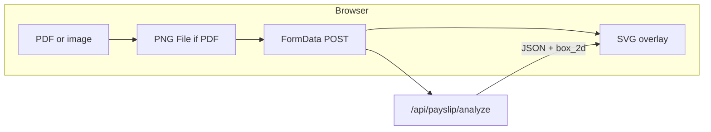

# Payslip annotation (frontend)

This document describes how payslip **visual highlights** work in the Nuxt SPA: PDF handling, coordinate mapping, and the **in-app SVG overlay** (not a flattened image).

## Guideline: draw in the app, not into the bitmap

**We keep annotations as an overlay in the browser** (SVG layered on top of the payslip image), **not** composited into the PNG/JPEG pixels before display.

Reasons:

- **Single source of truth** — The uploaded raster is exactly what the API analyzed; overlays are derived from the JSON response and can be toggled, restyled, or internationalized without re-encoding images.
- **Performance & simplicity** — No client-side canvas compositing or server round-trip to produce `output_annotated.png` for the MVP UI.
- **Accessibility & responsiveness** — The same `viewBox` scales with layout; ARIA and future interactions (e.g. focusable regions) stay in the DOM.

If we ever add a **download** of an annotated PNG, that would be an **optional** second step (e.g. canvas draw or server Sharp), not a replacement for the live overlay pattern.

**Clarification:** Overlays are implemented with **SVG** (`<svg>` in the Vue tree): a raster `<image>` for the payslip plus vector `<rect>` / `<text>` for highlights. That is still **in-app, non-destructive** overlay — we are **not** writing annotations into the bitmap pixels. “Draw in the app” means keep geometry and styling in the DOM, not bake them into the uploaded file.

## End-to-end flow

1. **Input** — User selects a raster image (PNG/JPEG/WebP) or a **PDF**.
2. **PDF (client only)** — [`pdf-rasterize.ts`](../../app/utils/pdf-rasterize.ts) uses PDF.js to render **page 1** at a fixed scale (`PDF_PAGE_RENDER_SCALE = 3`) and returns a **PNG `File`** for upload.
3. **Upload** — [`usePayslipAnalyze.ts`](../../app/composables/usePayslipAnalyze.ts) sends multipart `file` to the API; [`PayslipUploadPanel.vue`](../../app/components/payslip/PayslipUploadPanel.vue) handles accept/drop, PDF conversion, and `v-model:rasterizing` while converting.
4. **API** — `POST /api/payslip/analyze` returns `analysis`, `annotationSpecs`, `meta` (`width`, `height`, filenames, MIME), etc.
5. **Display** — [`index.vue`](../../app/pages/index.vue) keeps the **same `File`** the user submitted, creates `URL.createObjectURL` for the overlay after a successful analyze, and mounts [`PayslipAnnotationOverlay.vue`](../../app/components/payslip/PayslipAnnotationOverlay.vue) to draw boxes and badges in SVG.

## Key files

| Area | Location |
|------|----------|
| PDF → PNG | [`frontend/app/utils/pdf-rasterize.ts`](../../app/utils/pdf-rasterize.ts) |
| Normalized box → pixels | [`frontend/app/utils/box2d.ts`](../../app/utils/box2d.ts) |
| Upload + PDF conversion UX | [`frontend/app/components/payslip/PayslipUploadPanel.vue`](../../app/components/payslip/PayslipUploadPanel.vue) |
| Overlay rendering | [`frontend/app/components/payslip/PayslipAnnotationOverlay.vue`](../../app/components/payslip/PayslipAnnotationOverlay.vue) |
| Analyze + object URL wiring | [`frontend/app/pages/index.vue`](../../app/pages/index.vue), [`frontend/app/composables/usePayslipAnalyze.ts`](../../app/composables/usePayslipAnalyze.ts) |
| Response types | [`frontend/app/types/payslip.ts`](../../app/types/payslip.ts) |

## Coordinate contract (must match backend)

Gemini-style **`box_2d`** is **`[y_min, x_min, y_max, x_max]`**, each component in **0–1000**, origin **top-left**, **y** down.

Pixel rectangles use **`meta.width`** and **`meta.height`** from the analyze response — they are the dimensions of the **uploaded bitmap** the server used. Conversion mirrors the backend helper in [`backend/src/payslip/box2d.ts`](../../../backend/src/payslip/box2d.ts).

The frontend **does not** infer box placement; it only maps API numbers to pixels. If a box appears vertically or horizontally wrong, the cause is almost always **model output** or **fixture mismatch**, not overlay math (see [backend/docs/payslip-analysis/bounding_boxes.md](../../../backend/docs/payslip-analysis/bounding_boxes.md)).

## Invariant: one raster for analysis and overlay

From the POC write-up: the bitmap sent to the model must be the same bitmap you draw on.

On the frontend that means:

- For **PDF**, rasterize **once** to a PNG `File`, POST that file, and use **that same file** (via `URL.createObjectURL`) for the overlay base image.
- Do **not** re-render the PDF at a different scale for “preview” vs “upload”.

Breaking this produces the same class of misalignment as mixing native PDF in Gemini with a different pdf.js render on the server.

## What we draw (Phase 1)

Only **`annotationSpecs`** from the API are rendered (gap highlights and similar feature-driven specs), not every `insights[]` row. That matches the plan to avoid turning the UI into a noisy full-field debug view while still showing **actionable** highlights.

Each spec includes:

- `box_2d` — normalized rectangle (when invalid / empty, the spec is skipped).
- `strokeColor` — used for the **focus rectangle** and the **label badge** fill (typically red for payslip gaps).
- `label` — short Hebrew/English caption.
- `preferLabelBelow` — when true, the badge is placed **under** the box (avoids covering header rows like מצב משפחתי / נ״ז), consistent with the POC’s `AnnotationSpec.preferLabelBelow`.

## Overlay implementation choices (SVG)

- **`viewBox="0 0 meta.width meta.height"`** with **`preserveAspectRatio="xMidYMid meet"`** — the payslip and overlays scale together in the layout; no manual resize math.
- **Base layer** — `<image href="…">` pointing at a blob URL of the uploaded raster.
- **Highlight** — `<rect>` stroke in `strokeColor`, no fill.
- **Label** — solid rounded **badge** (`<rect rx ry>`) filled with `strokeColor`, **white** **`font-weight: 700`** text centered in the badge — high contrast and aligned with the prior CLI/Sharp output style, without outlined/hollow text (which was hard to read on white payslip backgrounds).
- **Typography scale** — `fontSize` is derived from `meta.height` (clamped) so labels stay readable on large payroll rasters without dominating small images.

## PDF.js and Workers

[`pdf-rasterize.ts`](../../app/utils/pdf-rasterize.ts) sets `GlobalWorkerOptions.workerSrc` via a Vite **`?url`** import of the pdf.js worker so parsing runs off the main thread where supported. Failures (encrypted PDFs, broken files) surface as user-visible errors in the upload panel.

## Dev fixture caveat

When the backend uses **`PAYSLIP_USE_ANALYZE_FIXTURE`**, JSON `analysis` / `annotationSpecs` are static while **`meta.width` / `meta.height`** are recomputed from whatever file you upload. Overlays will **only** line up if that file matches the fixture image the JSON was produced for. Real Gemini responses do not have this split.

## General guidelines (for future work)

1. **Prefer in-app overlay** for interactive UI; add **export-to-PNG** only if product needs a shareable file.
2. **Never “nudge” `box_2d` in the UI** to fix model drift — fix prompts, refinement (e.g. נ״ז crop pass), or fixtures on the backend.
3. **Reuse `meta` + `box2dToPixelRect`** for any new overlay (e.g. optional `insights` boxes, click-to-scroll) so one coordinate pipeline stays consistent.
4. **RTL** — Labels use `direction: rtl` on SVG text where Hebrew dominates; extend with `foreignObject` if multi-line wrapping becomes necessary.
5. **Performance** — High `PDF_PAGE_RENDER_SCALE` improves OCR/box quality but increases canvas memory; adjust the constant rather than adding a second render path.

## Related documentation

- [backend/docs/payslip-analysis/bounding_boxes.md](../../../backend/docs/payslip-analysis/bounding_boxes.md) — coordinate semantics, same-raster rule, crop refinement.
- [backend/docs/payslip-analysis/architecture.md](../../../backend/docs/payslip-analysis/architecture.md) — server pipeline and `AnnotationSpec` origin.
